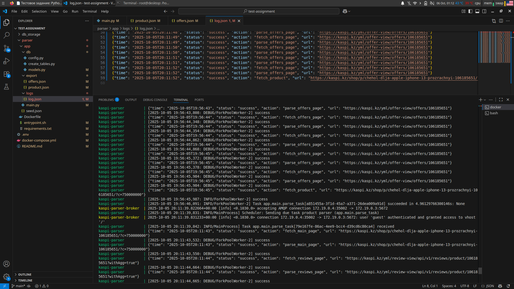
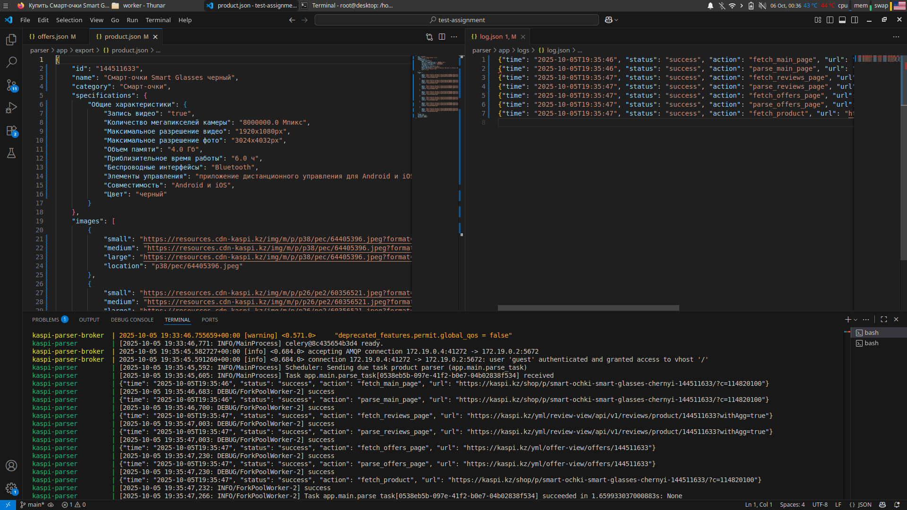

# Тестовое задание: Парсер Kaspi магазина

## 📌 Описание проекта
Программа собирает данные с карточки товара на сайте kaspi. Среди собираемых полей: название, категория, минимальная цена, максимальная цена, рейтинг, количество отзывов, характеристики, предложения продавцов, ссылки на изображения, количество продавцов. Информация о товаре попадает в базу данных PostgreSQL, файл parser/export/product.json. Предложения продавцов попадают в parser/export/offers.json. В db_storage после запуска контейнера будет храниться ваша база данных.

## 🚀 Установка и запуск

### 1. Клонирование репозитория
`git clone https://github.com/fakhr-al-din/test-assignment.git`  
`cd test-assignment`  

### 2. Установка docker и docker compose
https://docs.docker.com/engine/install/  
https://docs.docker.com/compose/install/

### 3. Настройка окружения
При необходимости измените параметры базы данных в файле .env.  

### 4. Удалить содержимое выходных файлов
Для наглядности parser/app/offers.json и parser/app/product.json можно почистить.  
Оставил их с информацией для ознакомления с форматом вывода.  

### 5. Запуск парсера
`docker compose up -d --build`

## 📂 Структура проекта
test-assignment  
├── db_storage  
├── docker-compose.yml  
├── .env  
├── parser  
│   ├── app  
│   │   ├── db  
│   │   │   ├── config.py  
│   │   │   ├── create_tables.py  
│   │   │   └── models.py  
│   │   ├── export  
│   │   │   ├── offers.json  
│   │   │   └── product.json  
│   │   ├── logs  
│   │   │   └── log.json  
│   │   ├── main.py  
│   │   └── seed.json  
│   ├── Dockerfile  
│   ├── entrypoint.sh  
│   └── requirements.txt  
└── README.md  

## 🗄️ PostgreSQL  
Пример таблиц:  

**products**  
- id  
- name  
- category  
- min_price  
- max_price  
- rating  
- reviews_count  

**offers**
- id  
- product_id  
- seller_name
- seller_id  
- price  

## 🔄 Обновления данных  
- Интервал: 15 минут  
- Обновляются все поля, кроме идентификаторов
- Реализовано через Celery Beat и RabbitMQ

## 📝 Пример логов  
{"time": "2025-10-05T12:00:01", "status": "success", "action": "fetch_product", "url": "..."}  

## ✅ Что сделано  
- [x] Парсинг товара  
- [x] Сохранение в PostgreSQL  
- [x] Экспорт в JSON  
- [x] Логирование  
- [x] Docker  
- [x] Автоматический запуск каждые 15 минут
- [ ] Alembic миграции  

## 📄 Дополнительно  
- Больше всего времени ушло на настройку docker. Парсер не ждал готовности БД, хотя она была указана в depends_on. Оказалось, что не хватало условия condition. Еще был момент, что парсер не сохраняет данные в volume, хотя внутри контейнера они были. Выяснилось, что я по ошибке указал параметр volumes для контейнера БД, а не парсера
- Из улучшений сделать миграции через alembic

## Фотографии
Автоматический запуск каждые 15 минут   

  
Общий обзор  

